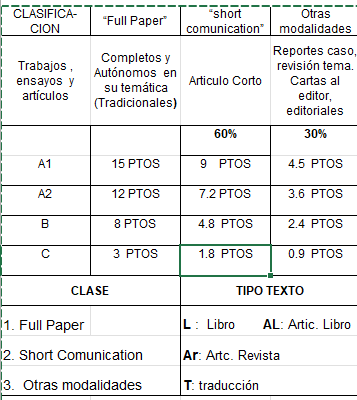

# AppSaludServer

API REST con Express + Firebase Firestore para gestionar dependencias, profesores, credenciales académicas y usuarios de la Universidad del Valle. Protegida con autenticación Firebase (Google) y lista blanca por colección `usuarios`.

---

## Estructura del proyecto

```
index.js                        → Punto de entrada y registro de rutas
src/
  config/
    firebase.js                 → Inicialización Firestore (SDK cliente)
    firebaseAdmin.js            → Cliente JWKS para verificar tokens sin service account
  models/                       → Schemas de validación Zod por entidad
  controllers/                  → Lógica CRUD y validaciones relacionales
  routes/                       → Rutas REST por recurso
  Middlewares/
    verificarToken.js           → Middleware de autenticación Firebase + lista blanca
```

---

## Autenticación

Todos los endpoints bajo `/api/*` requieren un **Firebase ID Token** válido en el header:

```
Authorization: Bearer <idToken>
```

### Cómo obtener el token (front-end)

El login se hace **directamente con Firebase Auth en el cliente** — el servidor no expone ningún endpoint de login. El flujo es:

1. El usuario hace clic en "Iniciar sesión con Google"
2. Firebase Auth abre el popup de Google (solo permite el dominio `@correounivalle.edu.co`)
3. El cliente verifica que el email esté en la colección `usuarios` con `estado == "ACTIVO"`
4. Si está autorizado, obtiene el `idToken` y lo adjunta a todas las peticiones al servidor

```js
// authService.js (cliente)
import { loginConGoogle, logout, getIdToken } from "./auth/authService";

// Login
const { email, permiso, dependencia_actual, idToken } = await loginConGoogle();

// Obtener token fresco para una request (se renueva automáticamente)
const token = await getIdToken();

// Logout
await logout();
```

```js
// apiClient.js (cliente) — usar en vez de fetch directamente
import { apiFetch } from "./api/apiClient";

const profesores = await apiFetch("/profesores");           // GET
const nuevo = await apiFetch("/profesores", {              // POST
  method: "POST",
  body: JSON.stringify({ ... })
});
```

### Respuestas de error de autenticación

| Código | Causa                                                               |
| ------ | ------------------------------------------------------------------- |
| `401`  | No se envió token, o está expirado / malformado                     |
| `403`  | Email no está en la colección `usuarios` o tiene `estado != ACTIVO` |

---

## Endpoints CRUD

**Base URL:** `http://localhost:3000/api`

> Todos los endpoints requieren el header `Authorization: Bearer <idToken>`

---

### 🔐 Usuarios (lista blanca)

> Los usuarios **no se crean desde el login** — se registran manualmente en Firestore o vía este CRUD por un administrador.

#### `POST /api/usuarios`

Crea un usuario en la lista blanca.

**Body:**

```json
{
  "email": "juan.perez@correounivalle.edu.co",
  "permiso": "LECTURA",
  "estado": "ACTIVO",
  "dependencia_actual": {
    "escuela_o_oficina_id": "<id_firestore>",
    "departamento_id": "<id_firestore>",
    "seccion_id": "<id_firestore>",
    "ancestros": ["<id1>", "<id2>"]
  }
}
```

> `dependencia_actual` es **obligatorio** solo si `permiso` es `"DIRECTOR ESCUELA"` o `"DIRECTOR OFICINA"`. Para los demás permisos es opcional.

**Permisos válidos:** `ADMINISTRADOR`, `LECTURA`, `SISTEMAS`, `EDITOR`, `DIRECTOR ESCUELA`, `DIRECTOR OFICINA`

**Respuesta `201`:**

```json
{
  "id": "abc123xyz",
  "email": "juan.perez@correounivalle.edu.co",
  "permiso": "LECTURA",
  "estado": "ACTIVO",
  "dependencia_actual": { ... },
  "createdAt": "2026-08-25T15:00:00.000Z",
  "updatedAt": "2026-08-25T15:00:00.000Z",
  "lastLoginAt": "2026-08-25T15:00:00.000Z"
}
```

---

#### `GET /api/usuarios`

Retorna todos los usuarios registrados.

**Respuesta `200`:**

```json
[
  {
    "id": "abc123xyz",
    "email": "juan.perez@correounivalle.edu.co",
    "permiso": "LECTURA",
    "estado": "ACTIVO",
    ...
  }
]
```

---

#### `GET /api/usuarios/:id`

Retorna un usuario por su ID de Firestore.

**Respuesta `200`:** objeto de usuario. **`404`** si no existe.

---

#### `PUT /api/usuarios/:id`

Actualiza parcialmente un usuario. Todos los campos son opcionales.

**Body (ejemplo):**

```json
{
  "permiso": "EDITOR",
  "estado": "INACTIVO"
}
```

**Respuesta `200`:** objeto actualizado. **`404`** si no existe.

---

#### `DELETE /api/usuarios/:id`

Elimina un usuario de la lista blanca.

**Respuesta `200`:**

```json
{ "message": "Usuario eliminado correctamente" }
```

---

### 🏛️ Dependencias

Las dependencias tienen jerarquía: `ESCUELA/OFICINA → DEPARTAMENTO → SECCION`. El campo `padre_id` define el nodo padre; el servidor calcula `ancestros` automáticamente.

#### `POST /api/dependencias`

Crea una dependencia.

**Body:**

```json
{
  "nombre": "Escuela de Ingeniería de Sistemas",
  "tipo": "ESCUELA",
  "padre_id": null
}
```

```json
{
  "nombre": "Departamento de Redes",
  "tipo": "DEPARTAMENTO",
  "padre_id": "<id_escuela>"
}
```

**Tipos válidos:** `ESCUELA`, `OFICINA`, `DEPARTAMENTO`, `SECCION`

> `padre_id` es `null` para raíces (ESCUELA u OFICINA). El campo `ancestros` **no se envía** — el servidor lo calcula solo.

**Respuesta `201`:**

```json
{
  "id": "dep789",
  "nombre": "Departamento de Redes",
  "tipo": "DEPARTAMENTO",
  "padre_id": "esc001",
  "ancestros": ["esc001"],
  "createdAt": "2026-08-25T15:00:00.000Z"
}
```

---

#### `GET /api/dependencias`

Retorna todas las dependencias.

**Respuesta `200`:** array de dependencias.

---

#### `GET /api/dependencias/:id`

Retorna una dependencia por ID.

**Respuesta `200`:** objeto. **`404`** si no existe.

---

#### `PUT /api/dependencias/:id`

Actualiza parcialmente una dependencia. Si se actualiza `padre_id`, el servidor recalcula `ancestros`.

**Body (ejemplo):**

```json
{
  "nombre": "Departamento de Redes y Comunicaciones"
}
```

**Respuesta `200`:** objeto actualizado.

---

#### `DELETE /api/dependencias/:id`

Elimina una dependencia.

> ⚠️ **Falla con `409`** si:
>
> - Tiene dependencias hijas (`padre_id` apunta a esta)
> - Hay profesores adscritos a ella

**Respuesta `200`:**

```json
{ "message": "Dependencia eliminada correctamente" }
```

**Respuesta `409`:**

```json
{ "message": "No se puede eliminar: existen dependencias hijas asociadas" }
```

---

### 👨‍🏫 Profesores

#### `POST /api/profesores`

Crea un profesor. El `numero_identificacion` debe ser único.

**Body:**

```json
{
  "tipo_identificacion": "CEDULA",
  "numero_identificacion": "1234567890",
  "nombres": "Juan Carlos",
  "apellidos": "Pérez Gómez",
  "email_institucional": "juan.perez@correounivalle.edu.co",
  "lugar_nacimiento": "Cali",
  "fecha_nacimiento": "1985-03-15",
  "telefono": "3001234567",
  "fecha_vinculacion": "2010-01-01",
  "foto_url": "https://...",
  "dependencia_actual": {
    "escuela_o_oficina_id": "<id_escuela>",
    "departamento_id": "<id_departamento>",
    "seccion_id": "<id_seccion>",
    "ancestros": ["<id1>", "<id2>"]
  },
  "estado": "ACTIVO"
}
```

> Campos opcionales: `lugar_nacimiento`, `fecha_nacimiento`, `telefono`, `fecha_vinculacion`, `foto_url`, `dependencia_actual.departamento_id`, `dependencia_actual.seccion_id`

> **Tipos de identificación válidos:** `CEDULA`, `PASAPORTE`, `TARJETA_IDENTIDAD`

**Respuesta `201`:** objeto del profesor creado con su `id` de Firestore.

**Respuesta `409`:**

```json
{ "message": "Ya existe un profesor con ese numero de identificacion" }
```

---

#### `GET /api/profesores`

Retorna todos los profesores.

**Respuesta `200`:** array de profesores.

---

#### `GET /api/profesores/:id`

Retorna un profesor por su ID de Firestore.

**Respuesta `200`:** objeto. **`404`** si no existe.

> Esta respuesta incluye `docente_periodos`, que es un array con los periodos docentes asociados al profesor.

**Ejemplo de respuesta `200`:**

```json
{
  "id": "prof_123",
  "tipo_identificacion": "CEDULA",
  "numero_identificacion": "1234567890",
  "nombres": "Juan Carlos",
  "apellidos": "Pérez Gómez",
  "email_institucional": "juan.perez@correounivalle.edu.co",
  "estado": "ACTIVO",
  "docente_periodos": [
    {
      "id": "prof_123_2026-1",
      "profesor_id": "prof_123",
      "periodo_id": "2026-1",
      "tipo_vinculacion": "NOMBRADO",
      "dedicacion": "COMPLETO",
      "categoria_docente": "ASOCIADO",
      "estado": "ACTIVO",
      "nivel": "MAESTRIA",
      "periodo": {
        "id": "2026-1",
        "periodo": "2026-1",
        "createdAt": "2026-08-25T15:00:00.000Z"
      }
    }
  ]
}
```

---

#### `PUT /api/profesores/:id`

Actualiza parcialmente un profesor. Todos los campos son opcionales.

**Body (ejemplo):**

```json
{
  "telefono": "3109876543",
  "estado": "INACTIVO"
}
```

**Respuesta `200`:** objeto actualizado con `updatedAt` renovado.

---

#### `DELETE /api/profesores/:id`

Elimina un profesor.

> ⚠️ **Falla con `409`** si tiene periodos docentes asociados o credenciales asociadas.

**Respuesta `200`:**

```json
{ "message": "Profesor eliminado correctamente" }
```

---

### 📅 Periodos

La colección `periodos` se usa como catálogo oficial para los periodos académicos. El `id` del documento es el mismo valor del periodo, por ejemplo `2026-1`.

#### `POST /api/periodos`

Crea un periodo.

**Body:**

```json
{
  "periodo": "2026-1"
}
```

**Formato válido:** `YYYY-1` o `YYYY-2`

**Respuesta `201`:**

```json
{
  "id": "2026-1",
  "periodo": "2026-1",
  "createdAt": "2026-08-25T15:00:00.000Z"
}
```

**Respuesta `409`:**

```json
{ "message": "Ya existe ese periodo" }
```

---

#### `GET /api/periodos`

Retorna todos los periodos registrados.

**Respuesta `200`:**

```json
[
  {
    "id": "2026-1",
    "periodo": "2026-1",
    "createdAt": "2026-08-25T15:00:00.000Z"
  }
]
```

---

#### `GET /api/periodos/:id`

Retorna un periodo por su ID.

**Ejemplo:** `GET /api/periodos/2026-1`

**Respuesta `200`:** objeto de periodo. **`404`** si no existe.

---

#### `PUT /api/periodos/:id`

Actualiza parcialmente un periodo. En la práctica no se permite cambiar el `periodo` porque ese valor es el ID del documento.

**Body:** puede venir vacío solo si realmente no se desea cambiar nada, pero el backend responderá `400`.

**Respuesta `200`:** objeto actualizado.

**Respuesta `400`:**

```json
{
  "message": "No se permite actualizar el id del periodo. Elimina y crea un nuevo registro."
}
```

---

#### `DELETE /api/periodos/:id`

Elimina un periodo.

> ⚠️ Falla con `409` si existen registros en `docente_periodos` que apunten a ese `periodo_id`.

**Respuesta `200`:**

```json
{ "message": "Periodo eliminado correctamente" }
```

**Respuesta `409`:**

```json
{ "message": "No se puede eliminar: el periodo tiene docentes asociados" }
```

---

### 👩‍🏫 Docente Periodos

Esta colección representa la relación entre un profesor y un periodo académico.

#### `POST /api/docente-periodos`

Crea un registro de docente por periodo.

**Body:**

```json
{
  "profesor_id": "prof_123",
  "periodo_id": "2026-1",
  "tipo_vinculacion": "NOMBRADO",
  "dedicacion": "COMPLETO",
  "categoria_docente": "ASOCIADO",
  "estado": "ACTIVO",
  "nivel": "MAESTRIA"
}
```

**Campos obligatorios:**

- `profesor_id`
- `periodo_id`
- `tipo_vinculacion`
- `dedicacion`
- `categoria_docente`

**Campos opcionales:**

- `estado` tiene default `ACTIVO`
- `nivel`

**Respuesta `201`:**

```json
{
  "id": "prof_123_2026-1",
  "profesor_id": "prof_123",
  "periodo_id": "2026-1",
  "tipo_vinculacion": "NOMBRADO",
  "dedicacion": "COMPLETO",
  "categoria_docente": "ASOCIADO",
  "estado": "ACTIVO",
  "nivel": "MAESTRIA",
  "createdAt": "2026-08-25T15:00:00.000Z",
  "periodo": {
    "id": "2026-1",
    "periodo": "2026-1",
    "createdAt": "2026-08-25T15:00:00.000Z"
  }
}
```

**Posibles errores:**

- `400` si el profesor no existe
- `400` si el periodo no existe
- `409` si ya existe un registro para ese profesor y periodo

---

#### `GET /api/docente-periodos`

Retorna todos los registros de docente-periodo.

**Respuesta `200`:**

```json
[
  {
    "id": "prof_123_2026-1",
    "profesor_id": "prof_123",
    "periodo_id": "2026-1",
    "tipo_vinculacion": "NOMBRADO",
    "dedicacion": "COMPLETO",
    "categoria_docente": "ASOCIADO",
    "estado": "ACTIVO",
    "nivel": "MAESTRIA",
    "periodo": {
      "id": "2026-1",
      "periodo": "2026-1"
    }
  }
]
```

---

#### `GET /api/docente-periodos/:id`

Retorna un registro por su ID compuesto.

**Ejemplo:** `GET /api/docente-periodos/prof_123_2026-1`

**Respuesta `200`:** objeto del docente-periodo con el periodo expandido. **`404`** si no existe.

---

#### `PUT /api/docente-periodos/:id`

Actualiza parcialmente un registro.

**No se permite actualizar:**

- `profesor_id`
- `periodo_id`

**Body (ejemplo):**

```json
{
  "estado": "INACTIVO",
  "dedicacion": "PARCIAL"
}
```

**Respuesta `200`:** objeto actualizado con el periodo expandido.

**Respuesta `400`:**

```json
{
  "message": "No se permite actualizar profesor_id o periodo_id. Elimina y crea un nuevo registro."
}
```

---

#### `DELETE /api/docente-periodos/:id`

Elimina un registro de docente-periodo.

**Respuesta `200`:**

```json
{ "message": "DocentePeriodo eliminado correctamente" }
```

---

### 🧾 Asignaciones

La colección `asignaciones` guarda el detalle de actividades asociadas a un `docente_periodo`.  
El ID del documento se construye automáticamente como:

```txt
<profesor_id>_<docente_periodo_id>
```

#### `POST /api/asignaciones`

Crea una asignación para un profesor en un periodo docente.

**Body:**

```json
{
  "profesor_id": "prof_123",
  "docente_periodo_id": "prof_123_2026-1",
  "tipo_actividad": "Docencia",
  "actividad": "ACTIVIDADES DE DOCENCIA",
  "nombre_actividad": "Cátedra de Bases de Datos",
  "detalle_actividad": "Grupo 01, semestre 2026-1",
  "numero_horas": 8,
  "categoria": "DOCENTE"
}
```

**Campos obligatorios:**

- `profesor_id`
- `docente_periodo_id`
- `tipo_actividad`
- `actividad`

**Campos opcionales:**

- `nombre_actividad`
- `detalle_actividad`
- `numero_horas`
- `categoria`

**Valores válidos para `tipo_actividad`:**

- `Administrativas`
- `Comisión`
- `Complementarias`
- `Docencia`
- `Investigación`
- `Extensión`
- `Intelectual`
- `Sin actividades`

**Valores válidos para `actividad`:**

- `ACTIVIDADES ADMINISTRATIVAS`
- `ACTIVIDADES COMPLEMENTARIAS`
- `ACTIVIDADES DE DOCENCIA`
- `ACTIVIDADES DE EXTENSIÓN`
- `ACTIVIDADES DE INVESTIGACIÓN`
- `ACTIVIDADES INTELECTUALES O ARTISTICAS`
- `DOCENTE EN COMISIÓN`
- `SIN ACTIVIDADES`

**Respuesta `201`:**

```json
{
  "id": "prof_123_prof_123_2026-1",
  "profesor_id": "prof_123",
  "docente_periodo_id": "prof_123_2026-1",
  "tipo_actividad": "Docencia",
  "actividad": "ACTIVIDADES DE DOCENCIA",
  "nombre_actividad": "Cátedra de Bases de Datos",
  "detalle_actividad": "Grupo 01, semestre 2026-1",
  "numero_horas": 8,
  "categoria": "DOCENTE",
  "createdAt": "2026-08-27T15:00:00.000Z",
  "periodo": {
    "id": "2026-1",
    "periodo": "2026-1",
    "createdAt": "2026-08-25T15:00:00.000Z"
  }
}
```

**Posibles errores:**

- `400` si `profesor_id` no existe
- `400` si `docente_periodo_id` no existe
- `409` si ya existe una asignación para ese profesor y periodo

---

#### `GET /api/asignaciones/profesor/:profesorId`

Retorna todas las asignaciones asociadas a un profesor específico.

**Ejemplo:** `GET /api/asignaciones/profesor/prof_123`

**Respuesta `200`:**

```json
[
  {
    "id": "prof_123_prof_123_2026-1",
    "profesor_id": "prof_123",
    "docente_periodo_id": "prof_123_2026-1",
    "tipo_actividad": "Docencia",
    "actividad": "ACTIVIDADES DE DOCENCIA",
    "nombre_actividad": "Cátedra de Bases de Datos",
    "detalle_actividad": "Grupo 01, semestre 2026-1",
    "numero_horas": 8,
    "categoria": "DOCENTE",
    "periodo": {
      "id": "2026-1",
      "periodo": "2026-1"
    }
  }
]
```

Si el profesor no tiene asignaciones, la respuesta es un arreglo vacío: `[]`.

---

### 🎓 Credenciales

La colección `credenciales` guarda la hoja de vida académica del docente (eventos del CCS y factores de puntaje) en **un solo documento por profesor**. El `id` del documento es el mismo `profesor_id`.

Los arrays internos (`eventos_credenciales`, títulos, experiencia, etc.) no son colecciones aparte: viajan embebidos en ese documento.

#### `POST /api/credenciales`

Crea las credenciales de un profesor. El `profesor_id` debe existir en `profesores` y no puede repetirse.

**Body (mínimo):**

```json
{
  "profesor_id": "prof_123"
}
```

Los arrays vacíos y objetos por defecto los completa el servidor si no se envían.

**Body (completo, ejemplo):**

```json
{
  "profesor_id": "prof_123",
  "resumen_puntos": {
    "titulos_universitarios": 298.0,
    "categoria": 58.0,
    "experiencia_calificada": 40.27,
    "productividad_academica": 13.47,
    "puntos_totales": 409.7,
    "ultimo_evento_numero": 5,
    "fecha_ultima_actualizacion": "2026-07-09T00:00:00Z"
  },
  "eventos_credenciales": [
    {
      "numero_evento": 1,
      "clase": "Inclusión",
      "dedicacion": "A - T.C.",
      "factores_puntaje": {
        "titulos_universitarios": { "evento": 218.0, "tot_acum": 218.0 },
        "categoria": { "evento": 37.0, "tot_acum": 21.0 },
        "experiencia_calificada": { "evento": 1.27, "tot_acum": 27.19 },
        "productividad_academica": { "evento": 6.67, "tot_acum": 5.5 }
      },
      "puntos_del_evento": 262.94,
      "total_puntos_acumulado": 262.94,
      "soporte": {
        "acta_ccs": "20",
        "fecha": "2022-06-30T00:00:00Z",
        "firma_presidente_url": "https://firebasestorage.googleapis.com/.../firma_20.png"
      }
    }
  ],
  "titulos_universitarios": {
    "pregrado": [
      {
        "id": "tit_1",
        "evento_no": 1,
        "fecha_inicio": "2010-01-01T00:00:00Z",
        "fecha_fin": "2014-04-23T00:00:00Z",
        "titulo": "Nutricionista - Dietista",
        "tipo_pregrado": "OTROS_PROFESIONALES",
        "institucion_lugar": "Universidad Nacional de Colombia, Bogotá",
        "fecha_grado": "2014-04-23T00:00:00Z"
      }
    ],
    "posgrado": [
      {
        "id": "tit_2",
        "evento_no": 1,
        "fecha_inicio": "2018-01-01T00:00:00Z",
        "fecha_fin": "2020-07-17T00:00:00Z",
        "titulo": "Magíster en Políticas Públicas",
        "tipo_posgrado": "MAESTRIA",
        "institucion_lugar": "Universidad del Valle, Cali",
        "fecha_grado": "2020-07-17T00:00:00Z"
      }
    ]
  },
  "historial_categoria": [
    {
      "inclusion_no": "1a.INCLUSION",
      "fecha": "2022-06-30T00:00:00Z",
      "categoria": "A"
    }
  ],
  "experiencia_calificada": {
    "tiempo_parcial": [
      {
        "id": "exp_tp_1",
        "inclusion_no": 2,
        "fecha_inicio": "2019-01-28T00:00:00Z",
        "fecha_fin": "2019-06-12T00:00:00Z",
        "cargo": "Docente - Ocasional",
        "tipo_experiencia": "DOCENCIA",
        "codigo_dedicacion": "1",
        "institucion_lugar": "Institución Universitaria Escuela Nacional del Deporte",
        "anios_o_meses": "4M"
      }
    ],
    "hora_catedra": [
      {
        "id": "exp_hc_1",
        "evento_no": 1,
        "fecha_inicio": "2022-01-24T00:00:00Z",
        "fecha_fin": "2022-06-05T00:00:00Z",
        "institucion_lugar": "Pontificia Universidad Javeriana - Cali"
      }
    ]
  },
  "productividad_academica": [
    {
      "id": "prod_1",
      "inclusion_no": 1,
      "trabajo_no": 3,
      "titulo": "Prácticas alimentarias de familias afrodescendientes...",
      "publicacion_detalle": "Promoc. Salud. 2022; 27 (1): 143-158",
      "numero_autores": 4,
      "clase": "1",
      "tipo_texto": "Ar",
      "articulo_revista": "B"
    }
  ],
  "premios_y_patentes": [
    {
      "id": "prem_1",
      "evento_no": 1,
      "premio_no": 1,
      "tipo": "PREMIO",
      "descripcion": "Premio Nacional de Investigación",
      "fecha": "2024-05-10T00:00:00Z"
    }
  ],
  "docencia_destacada": [
    {
      "id": "doc_1",
      "evento_no": 5,
      "semestre": 2,
      "anio": 2024,
      "asignatura": "Nutrición y Salud - 402007C",
      "fecha_solicitud": "2025-03-02T00:00:00Z"
    }
  ],
  "extension_destacada": []
}
```

**Campos / valores relevantes (NUEVOS ENUMS PARA CÁLCULO AUTOMÁTICO):**
- `titulos_universitarios.pregrado[].tipo_pregrado`: `MEDICINA_O_MUSICA`, `OTROS_PROFESIONALES`
- `titulos_universitarios.posgrado[].tipo_posgrado`: `ESPECIALIZACION`, `ESPECIALIZACION_CLINICA`, `MAESTRIA`, `DOCTORADO`
- `experiencia_calificada.tiempo_parcial[].tipo_experiencia`: `INVESTIGACION`, `DOCENCIA`, `DIRECCION`, `OTRA_PROFESIONAL`
- `productividad_academica[].tipo_texto`: `L`, `AL`, `Ar`, `T`
- `productividad_academica[].numero_autores`: Número entero, mínimo 1.
- `premios_y_patentes[].tipo`: `PREMIO`, `PATENTE`
- `eventos_credenciales[].clase`: `Inclusión`, `Ascenso`, `Actualización`
- `historial_categoria[].categoria`: `A`, `B`, `C`, `D`
- `experiencia_calificada.tiempo_parcial[].codigo_dedicacion`: `1`, `2`

`experiencia_calificada.tiempo_parcial[].anios_o_meses` se calcula automáticamente
en el backend usando `fecha_inicio` y `fecha_fin`. No es necesario enviarlo en el
body. Si la duración es menor a un año, se devuelve como meses enteros con la
letra `M` (por ejemplo, `6M`). Si es de un año o más, se devuelve en años con
un máximo de un decimal y sin letra (por ejemplo, `1.5`).

> **Nota importante:** El cliente ya NO necesita enviar los campos `puntos`, `acumulado`, `total_con_tope`, ni `resumen_puntos`. Todos estos campos son calculados automáticamente por el `PuntajeService` del servidor.

**Respuesta `201`:**

```json
{
  "id": "prof_123",
  "profesor_id": "prof_123",
  "resumen_puntos": { ... },
  "eventos_credenciales": [ ... ],
  "titulos_universitarios": { "pregrado": [ ... ], "posgrado": [ ... ] },
  "historial_categoria": [ ... ],
  "experiencia_calificada": { "tiempo_parcial": [ ... ], "hora_catedra": [ ... ] },
  "productividad_academica": [ ... ],
  "premios_y_patentes": [],
  "docencia_destacada": [ ... ],
  "extension_destacada": [],
  "updatedAt": "2026-09-01T20:00:00.000Z"
}
```

**Posibles errores:**

- `400` si el profesor no existe
- `409` si ya existen credenciales para ese profesor

---

#### `GET /api/credenciales`

Retorna todas las credenciales registradas.

**Respuesta `200`:** array de documentos de credenciales.

---

#### `GET /api/credenciales/:profesorId`

Retorna las credenciales de un profesor. El parámetro es el **ID del profesor** (mismo `id` del documento en Firestore).

**Ejemplo:** `GET /api/credenciales/prof_123`

**Respuesta `200`:** objeto de credenciales. **`404`** si no existe.

**Ejemplo completo de respuesta `200` (todos los campos posibles):**

```json
{
  "id": "prof_123",
  "profesor_id": "prof_123",
  "resumen_puntos": {
    "titulos_universitarios": 223,
    "categoria": 58,
    "experiencia_calificada": 18,
    "productividad_academica": 26,
    "puntos_totales": 308.5,
    "ultimo_evento_numero": 5,
    "fecha_ultima_actualizacion": "2026-09-01T20:00:00.000Z"
  },
  "eventos_credenciales": [
    {
      "numero_evento": 1,
      "clase": "Inclusión",
      "dedicacion": "A - T.C.",
      "factores_puntaje": {
        "titulos_universitarios": { "evento": 218, "tot_acum": 218 },
        "categoria": { "evento": 37, "tot_acum": 37 },
        "experiencia_calificada": { "evento": 8, "tot_acum": 8 },
        "productividad_academica": { "evento": 20, "tot_acum": 20 }
      },
      "puntos_del_evento": 283,
      "total_puntos_acumulado": 283,
      "soporte": {
        "acta_ccs": "20",
        "fecha": "2022-06-30T00:00:00Z",
        "firma_presidente_url": "https://storage.googleapis.com/.../firma_20.png"
      }
    }
  ],
  "titulos_universitarios": {
    "pregrado": [
      {
        "id": "tit_1",
        "evento_no": 1,
        "fecha_inicio": "2010-01-01T00:00:00Z",
        "fecha_fin": "2014-04-23T00:00:00Z",
        "titulo": "Nutricionista - Dietista",
        "tipo_pregrado": "OTROS_PROFESIONALES",
        "institucion_lugar": "Universidad Nacional de Colombia, Bogotá",
        "fecha_grado": "2014-04-23T00:00:00Z",
        "puntos": 178,
        "acumulado": 178
      }
    ],
    "posgrado": [
      {
        "id": "tit_2",
        "evento_no": 1,
        "fecha_inicio": "2018-01-01T00:00:00Z",
        "fecha_fin": "2020-07-17T00:00:00Z",
        "titulo": "Magíster en Políticas Públicas",
        "tipo_posgrado": "MAESTRIA",
        "institucion_lugar": "Universidad del Valle, Cali",
        "fecha_grado": "2020-07-17T00:00:00Z",
        "puntos": 40,
        "acumulado": 40
      }
    ]
  },
  "historial_categoria": [
    {
      "inclusion_no": "1a.INCLUSION",
      "fecha": "2022-06-30T00:00:00Z",
      "categoria": "B",
      "puntos": 58
    }
  ],
  "experiencia_calificada": {
    "tiempo_parcial": [
      {
        "id": "exp_tp_1",
        "inclusion_no": 2,
        "fecha_inicio": "2019-01-28T00:00:00Z",
        "fecha_fin": "2019-06-12T00:00:00Z",
        "cargo": "Docente - Ocasional",
        "tipo_experiencia": "DOCENCIA",
        "codigo_dedicacion": "1",
        "institucion_lugar": "Institución Universitaria Escuela Nacional del Deporte",
        "anios_o_meses": "4M",
        "puntos_anio": 4,
        "puntos": 1.5,
        "total_acumulado": 1.5,
        "total_con_tope": 1.5
      }
    ],
    "hora_catedra": [
      {
        "id": "exp_hc_1",
        "evento_no": 1,
        "fecha_inicio": "2022-01-24T00:00:00Z",
        "fecha_fin": "2022-06-05T00:00:00Z",
        "institucion_lugar": "Pontificia Universidad Javeriana - Cali",
        "puntos_h_s_s": 1,
        "total_h_s_s_periodo": 10,
        "puntos": 10,
        "total_acumulado": 10,
        "total_con_tope": 10
      }
    ]
  },
  "productividad_academica": [
    {
      "id": "prod_1",
      "inclusion_no": 1,
      "trabajo_no": 3,
      "titulo": "Prácticas alimentarias de familias afrodescendientes",
      "publicacion_detalle": "Promoc. Salud. 2022; 27 (1): 143-158",
      "numero_autores": 1,
      "clase": "1",
      "tipo_texto": "Ar",
      "articulo_revista": "B",
      "libro": 0,
      "puntaje_acumulado": 15
    }
  ],
  "premios_y_patentes": [
    {
      "id": "prem_1",
      "evento_no": 1,
      "premio_no": 1,
      "tipo": "PREMIO",
      "descripcion": "Premio Nacional de Investigación",
      "fecha": "2024-05-10T00:00:00Z",
      "puntaje_parcial": 15,
      "puntaje_acumulado": 15
    }
  ],
  "docencia_destacada": [
    {
      "id": "doc_1",
      "evento_no": 5,
      "semestre": 2,
      "anio": 2024,
      "asignatura": "Nutrición y Salud - 402007C",
      "fecha_solicitud": "2025-03-02T00:00:00Z",
      "puntos_evento": 3,
      "acumulado_puntos": 3
    }
  ],
  "extension_destacada": [
    {
      "id": "ext_1",
      "evento_no": 5,
      "semestre": 2,
      "anio": 2024,
      "actividad": "Jornada de promoción de la salud",
      "fecha_solicitud": "2025-03-02T00:00:00Z",
      "puntos_evento": 3,
      "acumulado_puntos": 3
    }
  ],
  "createdAt": "2026-09-01T20:00:00.000Z",
  "updatedAt": "2026-09-01T20:00:00.000Z"
}
```

**Ejemplo de respuesta `200`:**

Los campos calculados por el servidor llegan dentro de cada registro del factor. El
campo acumulado de cada registro representa el total acumulado hasta ese registro.

```json
{
  "titulos_universitarios": {
    "pregrado": [
      {
        "tipo_pregrado": "MEDICINA_O_MUSICA",
        "puntos": 183,
        "acumulado": 183
      }
    ],
    "posgrado": [
      {
        "tipo_posgrado": "MAESTRIA",
        "fecha_inicio": "2020-01-01",
        "fecha_fin": "2022-01-01",
        "puntos": 40,
        "acumulado": 40
      }
    ]
  },
  "historial_categoria": [
    {
      "categoria": "B",
      "puntos": 58
    }
  ],
  "experiencia_calificada": {
    "tiempo_parcial": [
      {
        "tipo_experiencia": "DOCENCIA",
        "puntos_anio": 4,
        "puntos": 8,
        "total_acumulado": 8,
        "total_con_tope": 8
      }
    ],
    "hora_catedra": [
      {
        "total_h_s_s_periodo": 10,
        "puntos_h_s_s": 1,
        "puntos": 10,
        "total_acumulado": 10,
        "total_con_tope": 10
      }
    ]
  },
  "productividad_academica": [
    {
      "tipo_texto": "L",
      "numero_autores": 1,
      "puntaje_acumulado": 20
    }
  ],
  "premios_y_patentes": [
    {
      "tipo": "PATENTE",
      "puntaje_parcial": 25,
      "puntaje_acumulado": 25
    }
  ],
  "docencia_destacada": [
    {
      "puntos_evento": 3,
      "acumulado_puntos": 3
    }
  ],
  "extension_destacada": [
    {
      "puntos_evento": 3,
      "acumulado_puntos": 3
    }
  ],
  "resumen_puntos": {
    "titulos_universitarios": 223,
    "categoria": 58,
    "experiencia_calificada": 18,
    "productividad_academica": 26,
    "puntos_totales": 350
  }
}
```

Para consumirlos en el frontend, las rutas principales son:

- Pregrado: `titulos_universitarios.pregrado[].acumulado`
- Posgrado: `titulos_universitarios.posgrado[].acumulado`
- Categoría: `historial_categoria[].puntos`
- Experiencia tiempo parcial: `experiencia_calificada.tiempo_parcial[].total_acumulado` o `total_con_tope`
- Hora cátedra: `experiencia_calificada.hora_catedra[].total_acumulado` o `total_con_tope`
- Productividad: `productividad_academica[].puntaje_acumulado`
- Premios y patentes: `premios_y_patentes[].puntaje_acumulado`
- Docencia destacada: `docencia_destacada[].acumulado_puntos`
- Extensión destacada: `extension_destacada[].acumulado_puntos`
- Total general: `resumen_puntos.puntos_totales`

---

#### `PUT /api/credenciales/:profesorId`

Actualiza parcialmente las credenciales. Todos los campos son opcionales, **excepto que no se permite cambiar `profesor_id`**.

Para agregar un título, un evento o un ítem de experiencia, envía el array (o el objeto anidado) completo con el nuevo elemento incluido.

**Body (ejemplo):**

```json
{
  "resumen_puntos": {
    "titulos_universitarios": 298.0,
    "categoria": 58.0,
    "experiencia_calificada": 40.27,
    "productividad_academica": 13.47,
    "puntos_totales": 409.7,
    "ultimo_evento_numero": 5,
    "fecha_ultima_actualizacion": "2026-07-09T00:00:00Z"
  },
  "docencia_destacada": [
    {
      "id": "doc_1",
      "evento_no": 5,
      "semestre": 2,
      "anio": 2024,
      "asignatura": "Nutrición y Salud - 402007C",
      "fecha_solicitud": "2025-03-02T00:00:00Z",
      "puntos_evento": 3.0,
      "acumulado_puntos": 5.0
    }
  ]
}
```

**Respuesta `200`:** objeto actualizado con `updatedAt` renovado.

**Respuesta `400`:**

```json
{
  "message": "No se permite actualizar profesor_id. Elimina y crea un nuevo registro."
}
```

---

#### `DELETE /api/credenciales/:profesorId`

Elimina las credenciales del profesor. No elimina al profesor.

**Ejemplo:** `DELETE /api/credenciales/prof_123`

**Respuesta `200`:**

```json
{ "message": "Credenciales eliminadas correctamente" }
```

---

## Respuestas de error comunes

| Código | Causa                                                                  |
| ------ | ---------------------------------------------------------------------- |
| `400`  | Validación fallida (Zod) — la respuesta incluye `errors[]` con detalle |
| `400`  | IDs de dependencia referenciados no existen en Firestore               |
| `400`  | No se enviaron campos para actualizar                                  |
| `401`  | Token ausente, expirado o inválido                                     |
| `403`  | Usuario no en lista blanca o inactivo                                  |
| `404`  | Recurso no encontrado                                                  |
| `409`  | Conflicto de integridad referencial                                    |
| `500`  | Error interno del servidor                                             |

**Formato de error de validación (`400`):**

```json
{
  "message": "Error de validacion",
  "errors": [
    {
      "path": ["email"],
      "message": "Debe ser un correo valido"
    }
  ]
}
```

---

## Reglas de puntaje

1.1. PREGRADO
Por titulos universitarios en:
a. Medicina o composición musical,183 ptos.
b. Demás profesionales, 178 ptos.

1.2 POSTGRADO
(máximo puntaje acumulable 140 ptos)

a. Por titulos de especialización entre 1 y 2
años............................ Hasta 20 ptos.
Por año adicional o varias especializ. ( 10 ptos c/u)
Solo se reconocen hasta 2 especializaciones.
................................................................. Hasta 30 puntos.
En Medicina ( cada año) 15 ptos................Hasta 75 ptos
b. Por Título de Magister o Maestria,....hasta 40 ptos.
Por varios títulos (20 ptos adicionales)...hasta 60 ptos.
Por Magister o Maestria y especializaciónes sólo se
podrá acumular .................................... Hasta 60 puntos.
c. Por título de P¨HD o Doctorado...........hasta 80 ptos.
Varios títulos (40 puntos adicionales)..hasta 12o ptos
d. Para especializaciones clinicas en medicina humana y odontología 15 puntos por año...........hasta 75 ptos.

CATEGORIAS
A. Prof.Auxiliar 37 Ptos B. Prof.Asistente 58 Ptos
C-Prof.Asociado 74 Ptos D. Prof. Titular 96 Ptos.

\*\* C.D. Codigo de Dedicación

1. Tiempo Completo 2. Medio tiempo

2.1. Para quienes ingresan o reingresan:
a. En investigación en Instituciones dedicadas a ésta, en
cualquier campo de la ciencia, la técnica,las humanidades,
el arte o la pedagogía,...................................hasta 6 ptos/año.
b. Docencia Universitaria.......................... hasta 4 ptos/año.
c. En cargos de dirección académica en empresas o enti-
dades de reconocida calidad ................... Hasta 4 ptos/año.
d. Experiencia profesional calificada diferente a la dodente
............................................................................... Hasta 3 ptos/año.
Los años de estudios de postgrado no se contabilizan para
efectos de acreditación de puntaje, salvo para medicina y
odontologia.
El máximo puntaje que se podrá asignar por categoría,
Será:
Prof. Auxiliar 20 ptos. Prof. Asociado 90 ptos.
Prof. Asistente 45 Ptos Prof.Titular 120 Ptos.

Hora Catedra

Los puntos se asignan por cada hora/semana/semestre
(H/S/S)

El máximo puntaje que se podrá asignar por
categoría, será:

Prof. Auxiliar 20 ptos.
Prof. Asistente 45 ptos.
Prof. Asociado 90 ptos.
Prof, Titular 120 ptos.

PUBLICACIONES EN REVISTAS



CLASE TIPO TEXTO

1. Full Paper L : Libro AL: Artic. Libro |
2. Short Comunication Ar: Artc. Revista
3. Otras modalidades T: traducción
   LIBROS
4. Libros de investigación..............hasta 20 ptos
5. Libros de texto...........................hasta 15 ptos
   3.Libros de ensayo........................hasta 15 ptos
   4, Traducciones de libro................hasta 15 ptos.
   RESTRICCION DE PUNTAJES SEGÚN
   No. DE AUTORES

- Hasta 3 autores : Puntaje total cada uno.
- De 4 a 5 autores: 1/2 del punt.asignado a la public
- 6 ó más autores: Punt. Asig. A la publicación divido
  en la mitad del número de autores.

Por premios Nacionales e Inernacionales

Si el premio tiene diversas categorias o niveles , se graduan
los topes con base en las jerarquías del premio.
Hasta ...................................................................... 15 ptos.

PATENTES
Hasta.................................................................... 25 ptos.

DOCENCIA Y EXTENSION DESTACADAS

LOS PUNTOS OBTENIDOS POR DOCENCIA Y/O EXTENSION DESTACADA SE ADICIONAN AL ITEM DE PRODUCTiVIDAD ACADEMICA EN LA INCLUSION CORRESPONDIENTE QUE SE PRESENTA EN LA PAGINA NO. 1.

Los puntos seran asignados una (1) vez por año teniendo en cuenta la categoría (Res o73 -03 C.A:):

Profesor Titular Hasta 5 Puntos
Profesor Asociado Hasta 4 Puntos
Profesor Asistente Hasta 3 Puntos
Profesor Auxiliar Hasta 2 Puntos

---

---

## Relación entre modelos

```
Dependencia (ESCUELA/OFICINA)
  └── Dependencia (DEPARTAMENTO)  [padre_id → Escuela]
        └── Dependencia (SECCION) [padre_id → Departamento]

Profesor
  └── dependencia_actual → { escuela_o_oficina_id, departamento_id, seccion_id, ancestros }

DocentePeriodo
  └── profesor_id → Profesor

Credenciales (1 documento por profesor; id = profesor_id)
  └── profesor_id → Profesor
  └── eventos, títulos, categoría, experiencia, productividad, premios, docencia y extensión (embebidos)
```

## Reglas de integridad

- No se crea `Profesor` si los IDs en `dependencia_actual` no existen en Firestore.
- No se crea `DocentePeriodo` con `profesor_id` inexistente.
- No se crea `DocentePeriodo` con `periodo_id` inexistente.
- No se elimina `Dependencia` si tiene hijas o profesores asociados.
- No se elimina `Profesor` si tiene periodos docentes asociados.
- No se elimina `Profesor` si tiene credenciales asociadas.
- No se crea `Credenciales` con `profesor_id` inexistente.
- No se crea un segundo documento de `Credenciales` para el mismo profesor.
- En `Credenciales` no se puede cambiar `profesor_id` en update (eliminar y recrear).
- No se elimina `Periodo` si tiene `docente_periodos` asociados.
- En `DocentePeriodo` no se puede cambiar `profesor_id` ni `periodo_id` en update (eliminar y recrear).
- En `Asignaciones` no se puede cambiar `profesor_id` ni `docente_periodo_id` en update (eliminar y recrear).

---

## Ejecutar el proyecto

```bash
# Instalar dependencias
npm install

# Desarrollo (con hot reload)
npm run dev

# Producción
npm start
```

El servidor queda disponible en `http://localhost:3000`.
